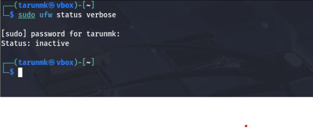
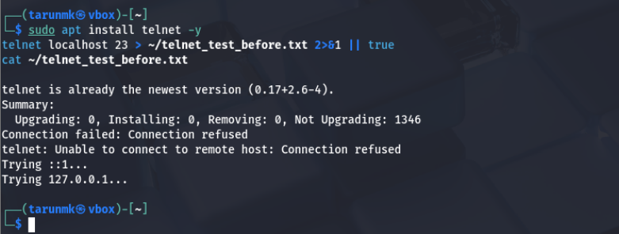
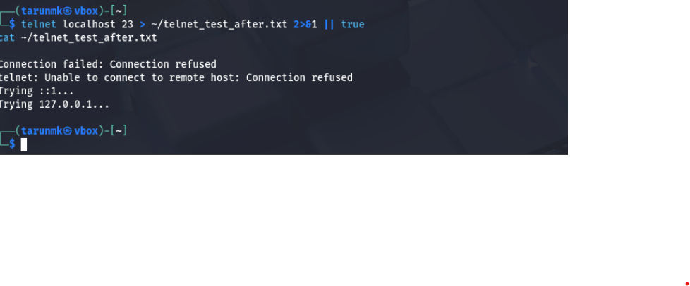
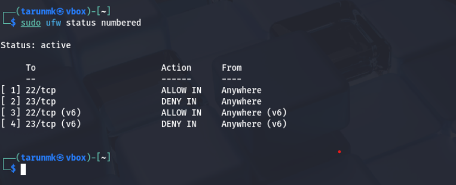
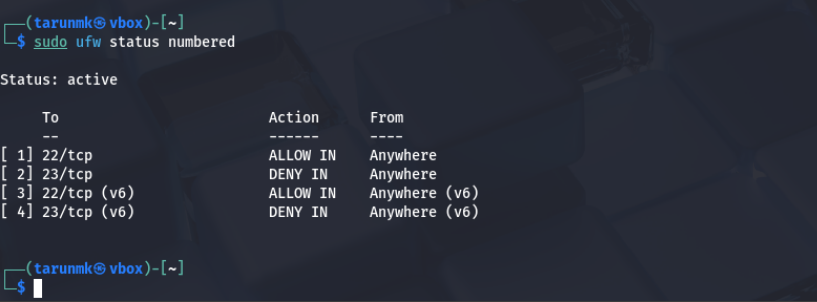

# UFW Firewall Configuration Task - Internship

## Objective  
Configure and verify firewall rules using UFW (Uncomplicated Firewall) on Kali Linux to block port 23 (Telnet) and allow port 22 (SSH).

---

## Steps Performed

1. **Checked initial UFW status (firewall inactive).**  
2. **Added deny rule for port 23 (Telnet) but firewall was inactive, so rules not enforced.**  
3. **Enabled UFW firewall.**  
4. **Verified that firewall was active with correct rules applied.**  
5. **Tested Telnet connection attempts to port 23 to confirm blocking.**

---

## Screenshots

1. UFW status before enabling firewall  


2. Telnet attempt blocked before enabling firewall  


3. Telnet attempt blocked after enabling firewall  


4. UFW deny rule added but firewall inactive  


5. UFW status final (firewall active with rules)  


---

## Commands Used  

```bash
sudo ufw status verbose
sudo ufw deny 23/tcp
sudo ufw status numbered
sudo ufw enable
sudo ufw status numbered
telnet localhost 23
nc -vz localhost 23
sudo ufw status verbose > ~/firewall_rules_final.txt
sudo ufw logging on
